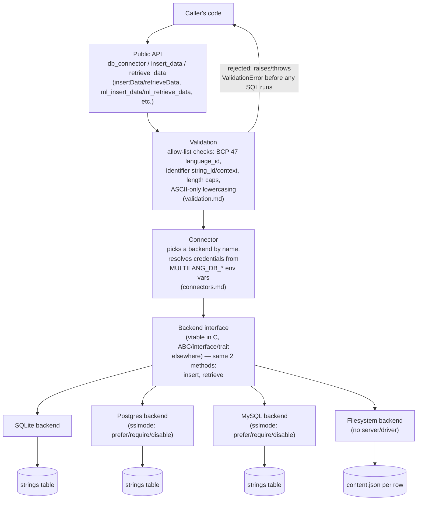
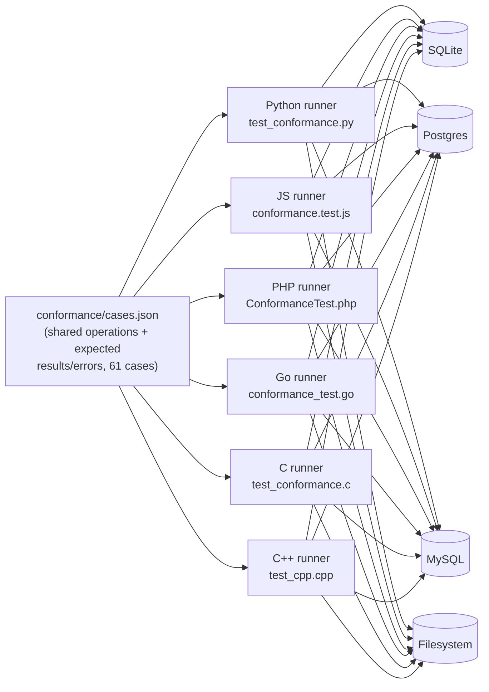
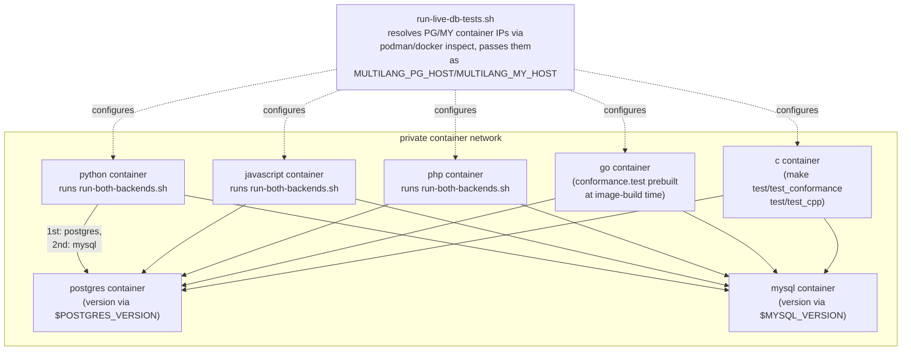
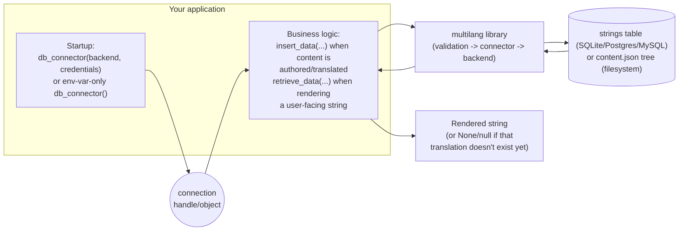

# Architecture diagrams

Four views of the same system, from the inside of one port out to how a
consuming application sees it. All diagrams are Mermaid, rendered inline
by GitHub and most Markdown viewers — no separate image-generation step
to keep in sync with the code.

## 1. Inside a single port

Every port follows the same four-layer shape: public functions never
touch SQL directly, validation never touches a driver, and the backend
is the only layer that knows which database it's talking to.

The point of drawing it this way: validation sits *before* the backend
split, so every backend receives already-clean input and can rely
exclusively on parameterized queries — no backend re-implements or
re-checks the allow-list rules, and no backend ever builds SQL by string
concatenation.

## 2. One fixture driving five ports and four backend families

`conformance/cases.json` is the only place a test case is defined. Each
port has a thin runner that replays it; none of the five hand-duplicate
the case list.

SQLite and the filesystem backend both run the full fixture on every
test invocation (no server, so no reason not to); Postgres/MySQL run it
via `MULTILANG_DB_BACKEND=postgres|mysql` against a real server — see
diagram 3, which the filesystem backend has no part of since it needs
no container.

A case failing on exactly one (port, backend) pair — not all of them —
is precisely how every cross-language inconsistency listed in
[`validation.md`](validation.md#resolved-cross-language-inconsistencies)
was actually found: the fixture is identical, so a divergent result
means the port's *implementation* diverged, not the test data.

## 3. Containerized live-DB test topology

`conformance/run-live-db-tests.sh` builds one image per language (not
per language×backend) and runs both backends from inside that single
container, addressed by container IP rather than DNS.

Nothing here runs on the host — per the containerized-testing
constraint, `run-live-db-tests.sh` itself only orchestrates `podman`/
`docker` commands; the actual test process, compiler, and language
runtime all execute inside the containers it starts.

## 4. How a consuming application integrates the library

Where the three public entry points sit relative to the caller's own
code — the same shape regardless of which port or backend is chosen.

The library never owns application state beyond the connection handle:
no caching layer, no global singleton, no framework coupling — a caller
decides when to call `retrieve_data` (e.g., per-request, or once at
startup into its own cache) and the library has no opinion about it.
